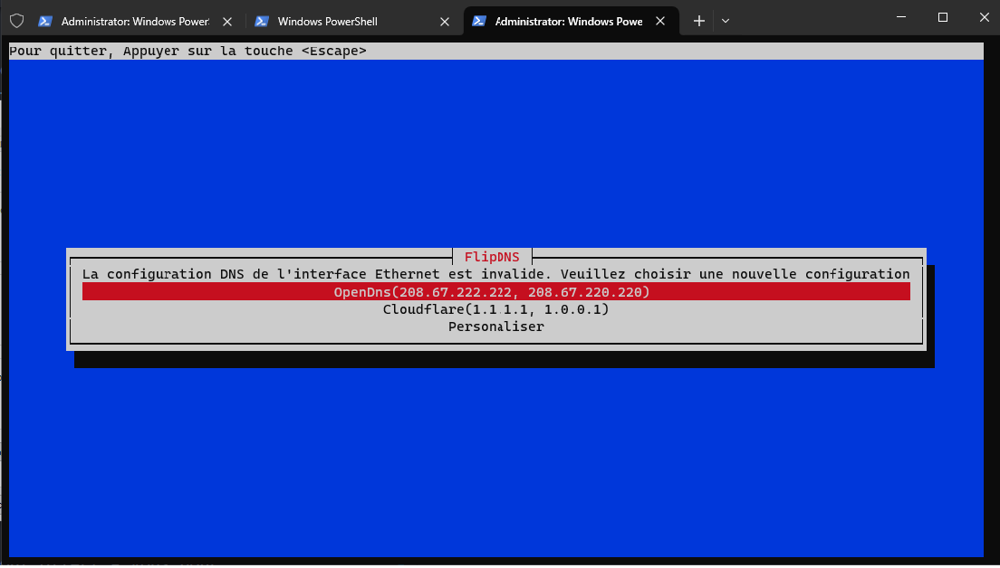

# FlipDNS-tp2

Utilitaire permettant de changer les valeurs DNS d'un client Windows.


## Structure du projet 

La structure du projet reste relativement simple. Son dossier se retrouvera a l'emplacement
C:\Program Files\FlipDNS et sera former ainsi:
```
FlipDNS
│   
├───data
│   output.txt
│   data.csv
│
FlipDNS.ps1
flipdns-menu.exe
```

#### Dossier Data
Ce dossier contiendra le fichier de sauvegarde output.csv (voir [Sauvegarde](#sauvegarde)) et un fichier temporaire nommer output.txt. Ce fichier permet au programme flipdns-menu.exe et le script FlipDNS.ps1 de se parler.

#### FlipDNS.ps1 
Ceci est le script principal, en powershell, il offre plusieurs arguments qui peuvent être passer au
script. Voir [Fonctionnement](#fonctionnement) pour plus d'information.

#### flipdns-menu.exe
Un programme TUI écrit en Rust permettant aux utilisateurs de choisir une nouvelle adresse DNS prédéfinie ou personnalisée. Ceci est possible grâce à la librairie cursive qui utilise ncurses en backend par défaut.


## Installation

Voici les deux possibilité qui sont offert a vous pour installer se script.

### Normale:

Pour installer ce script, vous devez:

1. Télécharger le depot
    ``` 
    git clone https://git.dti.crosemont.quebec/1834089/flipdns-tp2.git
    ```
2. Partir un terminal en étant administrateur
3. Executer le script install.sh 

### Construire le code source:


Si vous souhaitez construire le code source pour le menu flipdns-menu.exe, vous devez avoir installé le langage Rust et son gestionnaire de paquets Cargo. Vous pouvez l'installer à l'aide de l'installeur rustup, consultez https://www.rust-lang.org/tools/install.

1. Télécharger le depot
    ``` 
    git clone https://git.dti.crosemont.quebec/1834089/flipdns-tp2.git
    ```
2. Partir un terminal en étant administrateur
3. Executer le script install.sh avec le drapeau ```-build``` passe au script

## Sauvegarde

Le fichier que le script utilise comme mémoire ce trouve a être un fichier csv nomme ```save.csv```.
Le script entrepose sa sauvegarde dans un tableau comme ceci (avec des valeur aléatoire):

| name | type | current | original | last_change |
| ---- | ---- | ------- | -------- | ----------- |
| Ethernet | 4 | 8.8.8.8,8.8.4.4 | 1.1.1.1,1.1.0.0 | 23-11-11 11:59:29 |


### Description des valeurs

#### Name
----
*Nom d'une carte reseau.*

**Type attendu**: chaîne de caractère


#### Type
----
*La version d'adresse IP (devrait toujours être 4 car seulement les adresses IPV4 sont pris en charge).*

**Type attendu** : un nombre (4 ou 6)

#### current
----
*Les dernières adresses DNS récolter sur une carte reseau.*

**Type attendu** : liste de caractère contenant des address ip séparer par une virgule

#### original
----
*Les premiere adresse DNS récolter d'une carte reseau.*

**Type attendu** : liste de caractère contenant des address ip séparer par une virgule

#### last_change
----
*Une marque de temps représentant quand est-ce la dernière fois que le script a changer les valeur de la carte reseau*

**Type attendu** : une marque de temps dans le format suivant:
    
    Format: yy-MM-dd HH:mm:ss

    yy: les deux dernier chiffre de l’année
    MM: le numero du mois
    dd: le numero du jour
    HH: l'heure
    mm: minute
    ss: seconde
    

## Fonctionnement 

Le script FlipDNS.ps1 peut être exécuté n'importe où dans le système de fichiers du client, car l'installeur ajoute le chemin où le script réside dans la variable PATH. Naturellement, vu que le script modifie la valeur des cartes réseau, le script doit être exécuté avec les permissions administratives. Dans un cas contraire, aucune exécution ne sera faite grâce à la première ligne du script.
```
#Requires -RunAsAdministrator
```

L'exécution du script est similaire pour tous les modes d'exécution possibles, sauf si le fichier de sauvegarde est vide ou inexistant. Dans ce cas, seule l'exécution normale est possible car nous devons peupler le fichier de sauvegarde en premier. Le script teste seulement la résolution de google.com. Alors, si un DNS resolver local est utilisé, il doit être bien configuré pour prendre en charge cette demande.

Le programme flipdns-menu.exe est appelé par le script dans le cas où l'utilisateur doit choisir de nouvelles adresses de serveur DNS. Celui-ci affiche un menu TUI dans le terminal où le script a été exécuté. Celui-ci offre la possibilité de choisir entre: OpenDNS, CloudFare ou des adresses personnalisées.


Quand l'utilisateur a fait son choix, le programme écrit son choix dans le fichier ```output.txt``` pour que le script puisse connaître le choix de l'utilisateur.
